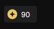

# </img> Truffle Auto Clicker

###  NOTICE

<b>By using this extension, users acknowledge and accept that the developer is in no way responsible for any bans, suspensions, or consequences incurred, and users assume full responsibility.</b>

With that said no bans, suspensions, or consequences, have been reported.
#
### Description
This is a Firefox extension to automatically click the Truffle claim points button. 
</img>

 <b>Note:</b> 
To quote the dev who made a similar extension for Chrome ([Link](https://chrome.google.com/webstore/detail/truffle-auto-bonus/dfcngoaoikgijdehhcjhnfgjbncfhalc)).

>If you are a dev on Truffle please don't patch this extension. I have a workaround but its more work so lets not do this whole arms race thing because I will win.

#
### Download
To get started click the hyperlinked download text below to add it to your browser.
 
No setup is required.

### [Download V1.1](https://addons.mozilla.org/firefox/downloads/file/4174996/d08e189b6eff4c7faa15-1.1.xpi)
